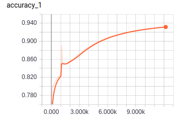
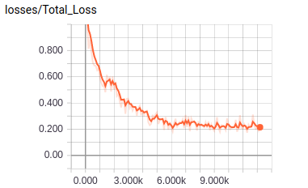
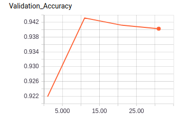

# fundus_binary_classification
## 眼底图二分类
参考[https://github.com/bendidi/X-ray-classification](https://github.com/bendidi/X-ray-classification)
tensorflow 实现谷歌[INCEPTION-RESNET-V2](https://github.com/tensorflow/models/tree/master/research/slim)迁移学习，主要修改最后一层，采用adam优化和学习率衰减的形式

    num_epochs = 200
    batch_size = 128
    initial_learning_rate = 0.001
    learning_rate_decay_factor = 0.7
    num_epochs_before_decay = 10

## 图像对比
* 正样本
 
* 负样本
 

## Dependencies
* tensorflow

 
其中，训练集正负样本各约3600

数据预处理为tensorflow record格式：

    python convertf.py

    ('dataset.num_samples', 7193)  7193训练
    ('num_batches_per_epoch', 56)
    ('decay_steps', 560)
    ('dataset.num_classes', 2)

训练数据集： tfdata/fundus_train_**.tfrecord 

测试数据集： tfdata/fundus_validation_**.tfrecord 

训练：

    python train.py

验证：
    python validation.py

## result
    Final Loss: 0.157448
    Final Accuracy: 0.932065

